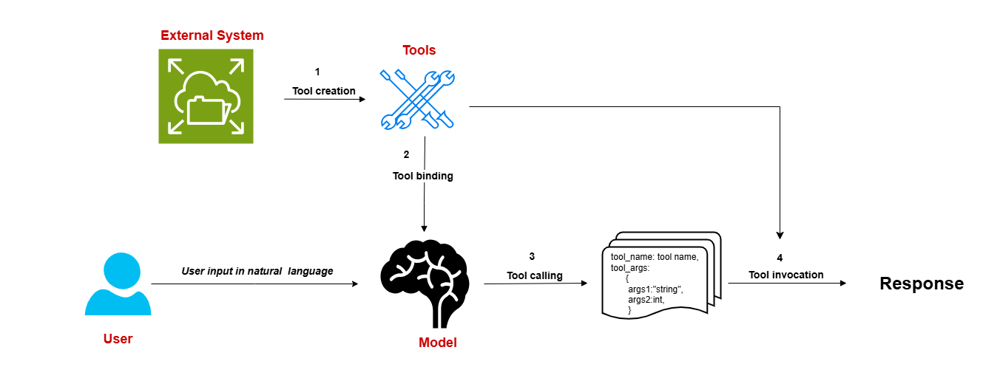

# Function Calling with Llama-3.2-3B via Ollama

This setup enables a chat-based assistant powered by the Llama-3.2-3B model through Ollama, allowing the model to perform specific tasks(Function Calling) like fetching weather,  or performing calculations by calling dedicated functions 


## How to set up and run the system

Install Dependencies

```bash
pip install -r requirements.txt
```

Once everything is set up, you can run the system by executing the main script:
```bash
python src/main.py
```
After running the script, the system will be ready to take user queries. You can type questions or requests in the terminal, such as:

"What is the current time?"
"What is the weather in New York?"
"Calculate the area of a circle with radius 5."
The system will process the request and respond with the appropriate answer.

To stop the application, simply type exit when prompted for input.


## The function calls are implemented and their expected behavior.

This project includes the following tools:

- **Current Time**: Fetches the current time in 12-hour format.
- **Current Date**: Retrieves the current date in YYYY-MM-DD format.
- **Area Calculator**: Calculates the area of shapes like circles, squares, rectangles, and triangles.
- **Math Operations**: Performs various mathematical operations like addition, subtraction, multiplication, division,squaring, and square roots.
- **Temperature Converter**: Converts temperatures between Celsius and Fahrenheit.
- **BMI Calculator**: Calculates the Body Mass Index (BMI).
- **Password Generator**: Generates strong passwords with a mix of letters, digits, and special characters.
- **Wikipedia Search**: Searches Wikipedia for a query and provides a summary.
- **Weather Forecast**: Fetches the current weather for a specified city.
- **Stock Price Lookup**: Retrieves the current price and currency of a given stock ticker.

### test.py 
a simpy pytest to test cover a variety of input scenarios call Right fuction call OR not

run
```bash
pytest test/ -v
```
### response_time.py
Provide a performance evaluation of the system, including average response time for different types of queries

